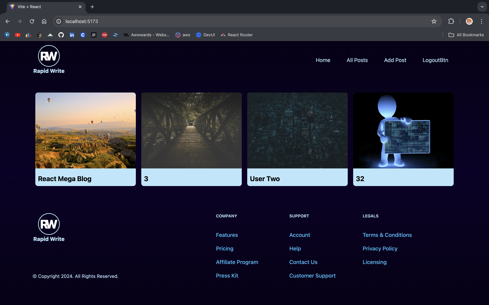
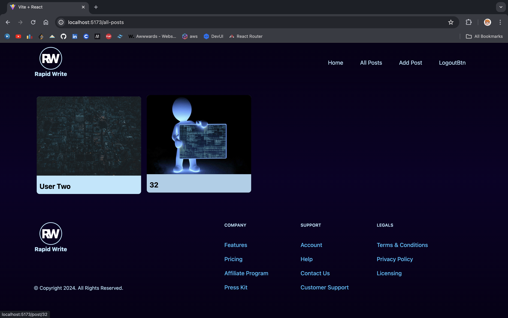
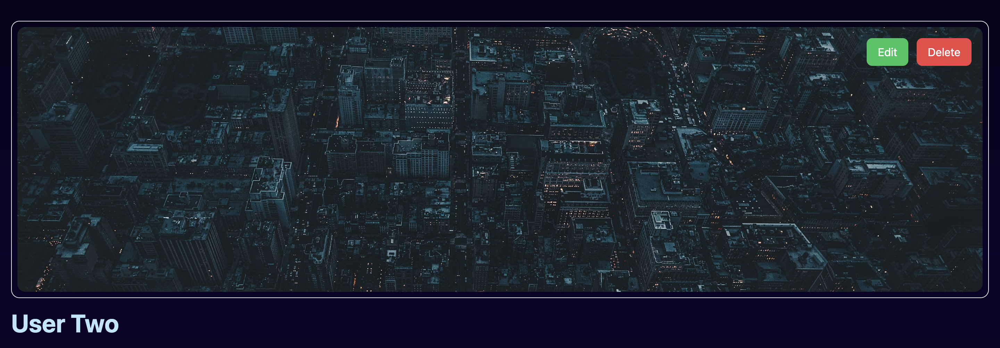
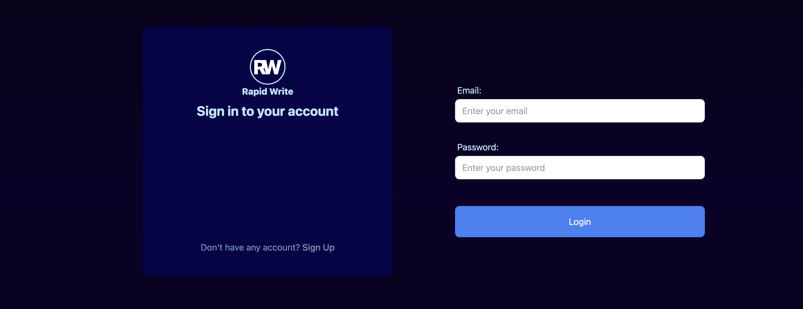
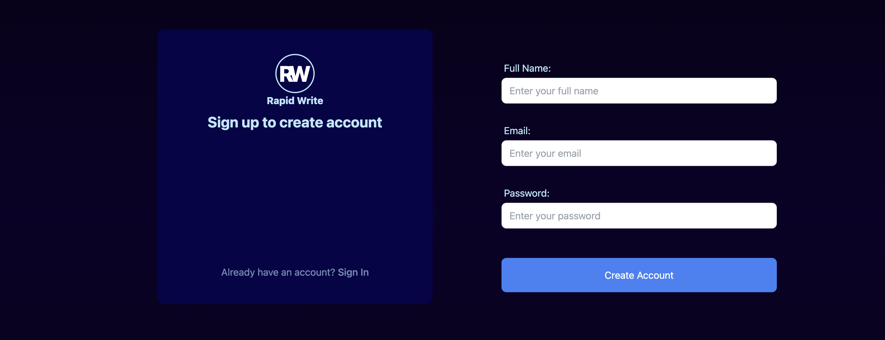
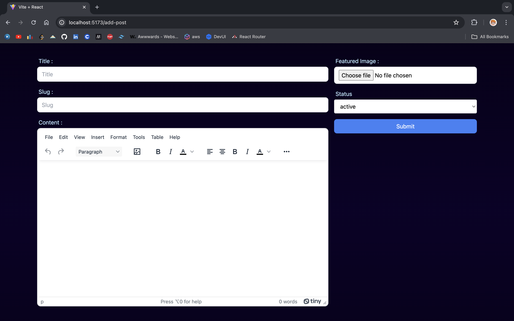

<a name="readme-top"></a>


[![Contributors][contributors-shield]][contributors-url]
[![Forks][forks-shield]][forks-url]
[![Stargazers][stars-shield]][stars-url]
[![Issues][issues-shield]][issues-url]
[![MIT License][license-shield]][license-url]
[![LinkedIn][linkedin-shield]][linkedin-url]


<!-- LOGO -->
<br />
<div align="center">
  <a href="https://www.github.com/falgunmpatel/RapidWrite">
    
  </a>
</div>


<!-- TABLE OF CONTENTS -->
<details>
  <summary>Table of Contents</summary>
  <ol>
    <li>
      <a href="#about-the-project">About The Project</a>
      <ul>
        <li><a href="#built-with">Built With</a></li>
      </ul>
    </li>
    <li>
      <a href="#getting-started">Getting Started</a>
      <ul>
        <li><a href="#prerequisites">Prerequisites</a></li>
        <li><a href="#installation">Installation</a></li>
      </ul>
    </li>
    <li><a href="#contributing">Contributing</a></li>
    <li><a href="#license">License</a></li>
    <li><a href="#contact">Contact</a></li>
    <li><a href="#acknowledgments">Acknowledgments</a></li>
  </ol>
</details>


<!-- ABOUT THE PROJECT -->
## About The Project

### 🚀 Rapid Write 📝
Rapid Write is a dynamic blogging website meticulously crafted with React for the frontend and Appwrite for the backend, offering a seamless and intuitive experience for bloggers and readers alike. With a focus on speed, efficiency, and functionality, Rapid Write leverages cutting-edge technologies such as react-hook-forms and TinyMCE Editor to provide users with a smooth and hassle-free writing experience.

🔑 Key Features
* User Authentication: Seamlessly manage user accounts with features for login, signup, and logout.
* Effortless Blogging: Create, edit, and delete posts with ease, all within an intuitive user interface.
* Streamlined Content Management: View all user posts or filter to see only your own, ensuring efficient content organization.
* State-of-the-Art State Management: Utilize Redux Toolkit for robust state management, ensuring optimal performance and scalability.
* Modular Component Architecture: Benefit from a well-organized and scalable codebase, enhancing maintainability and extensibility.
* And More: Explore additional features designed to enhance your blogging experience.


<p align="right">(<a href="#readme-top">back to top</a>)</p>


### 💻 Technologies Used
Frontend: React, react-hook-forms, TinyMCE Editor
Backend: Appwrite
State Management: Redux Toolkit


<p align="right">(<a href="#readme-top">back to top</a>)</p>

### Screenshots: 

<figure>
  
  <figcaption> Home Page - All Users Posts</figcaption>
</figure>

<figure>  
  <figcaption> User's Posts</figcaption>
</figure>

<figure>  
  <figcaption>Other User's Post</figcaption>
</figure>

<figure>  
  <figcaption>User's Post - Edit/Delete Option</figcaption>
</figure>

<figure>  
  <figcaption> Login Form</figcaption>
</figure>

<figure>  
  <figcaption> Signup Form</figcaption>
</figure>

<figure>  
  <figcaption> Post Form</figcaption>
</figure>


<!-- GETTING STARTED -->
## Getting Started

### Prerequisites
Basic knowledge of **React** is required to setup this project.

Download latest version of npm here:
* npm
 ```sh
  npm install npm@latest
  ```
**NOTE**: I use npm version @10.1.0 while creating this project

### Installation
1. Signup/Login @[Appwrite](https://appwrite.io/)
2. Setup an Appwrite Project.
    Appwrite Project Setup:
    1. Signup/Login to your appwrite account.
    2. Create a new project with desired title & region.
    3. Project -> Settings -> **Copy Project ID, and Api Endpoint** 
    4. Project -> Database Section -> Create Database -> **Copy Database Id** -> Create Collection -> **Copy Colection Id**
    5. Project -> Database -> Collection -> Settings -> **Update Permissions** -> Add a role -> All Users -> **Check all (Create, Read, Update, Delete)**
    6. Inside the created collention -> Attributes -> Create Attribute ->
      i. title -> String -> required
      ii. content -> String -> required
      iii. featuredImage -> String -> required
      iv. status -> String -> required
      v. userId -> String -> required 
    7. Project -> Storage Section -> Create Bucket -> **Copy Bucket Id** -> Required for setting up .env
    8. Project -> Storage -> Bucket -> Settings ->  **Update Permissions** -> Add a role -> All Users -> **Check all (Create, Read, Update, Delete)**
3. Create/Login TinyMCE Account -> Copy your API KEY -> Required for setting up .env
4. Clone the repo
   ```sh
   git clone https://github.com/falgunmpatel/rapid-write
   ```
5. Install NPM packages
   ```sh
   npm install
   ```
6. Create a .env file in the root directory of the project and add following content to it
    ```.env.sample
      VITE_APPWRITE_URL= "Your Apprite Project Api Endpoint"
      VITE_APPWRITE_PROJECT_ID="Your Apprite Project PROJECT ID"
      VITE_APPWRITE_DATABASE_ID="Your Apprite Project DATABASE ID"
      VITE_APPWRITE_COLLECTION_ID="Your Apprite Project COLLECTION ID"
      VITE_APPWRITE_BUCKET_ID="Your Apprite Project BUCKET ID"
      VITE_TINYMCE_API_KEY="Your TinyMCE API KEY"
    ```
7. Run the project by runnint the following command in the root directory of the project
    ```sh
      npm run dev
    ```

<p align="right">(<a href="#readme-top">back to top</a>)</p>


<!-- CONTRIBUTING -->
## Contributing

Contributions are what make the open source community such an amazing place to learn, inspire, and create. Any contributions you make are **greatly appreciated**.

If you have a suggestion that would make this better, please fork the repo and create a pull request. You can also simply open an issue with the tag "enhancement".
Don't forget to give the project a star! Thanks again!

1. Fork the Project
2. Create your Feature Branch (`git checkout -b feature/AmazingFeature`)
3. Commit your Changes (`git commit -m 'Add some AmazingFeature'`)
4. Push to the Branch (`git push origin feature/AmazingFeature`)
5. Open a Pull Request

<p align="right">(<a href="#readme-top">back to top</a>)</p>


<!-- LICENSE -->
## License

Distributed under the MIT License. See `LICENSE.txt` for more information.

<p align="right">(<a href="#readme-top">back to top</a>)</p>


<!-- CONTACT -->
## Contact

Name - Falgun Patel
Email - falgunmpatel9123@gmail.com

Project Link: [rapid-write](https://github.com/falgunmpatel/rapid-write)

<p align="right">(<a href="#readme-top">back to top</a>)</p>


<!-- ACKNOWLEDGMENTS -->
## Acknowledgments

  1. **React Playlist** @[ChaiAurCode](https://www.youtube.com/@chaiaurcode) <br/>
      **Mentor**: [Hitesh Choudhary](https://github.com/hiteshchoudhary)

  2. **Backend**: Docs @[Appwrite](https://appwrite.io/) 

  3. **Frontend**: Docs @[React](https://react.dev/)

  4. **Forms**: Docs @[React-Hook-Forms](https://react-hook-form.com/)

  5. **Editor for Creting Posts** : Docs @[TinyMCE](https://www.tiny.cloud/)

  6. **Toolchain/Bundler**: Docs @[Vite](https://vitejs.dev/guide/)


<p align="right">(<a href="#readme-top">back to top</a>)</p>


<!-- MARKDOWN LINKS & IMAGES -->
[contributors-shield]: https://img.shields.io/github/contributors/falgunmpatel/rapid-write.svg?style=for-the-badge
[contributors-url]: https://github.com/falgunmpatel/rapid-write/graphs/contributors
[forks-shield]: https://img.shields.io/github/forks/falgunmpatel/rapid-write.svg?style=for-the-badge
[forks-url]: https://github.com/falgunmpatel/rapid-write/network/members
[stars-shield]: https://img.shields.io/github/stars/falgunmpatel/rapid-write.svg?style=for-the-badge
[stars-url]: https://github.com/falgunmpatel/rapid-write/stargazers
[issues-shield]: https://img.shields.io/github/issues/falgunmpatel/rapid-write.svg?style=for-the-badge
[issues-url]: https://github.com/falgunmpatel/rapid-write/issues
[license-shield]: https://img.shields.io/github/license/falgunmpatel/rapid-write.svg?style=for-the-badge
[license-url]: https://github.com/falgunmpatel/rapid-write/blob/master/LICENSE
[linkedin-shield]: https://img.shields.io/badge/-LinkedIn-black.svg?style=for-the-badge&logo=linkedin&colorB=555
[linkedin-url]: https://linkedin.com/in/falgunmpatel
